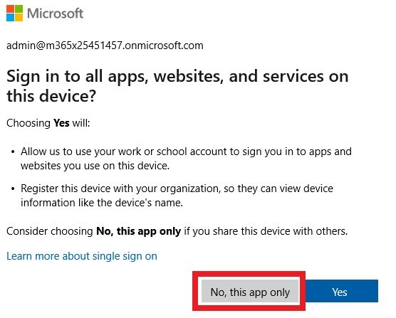

# ラボ 0101: Entra ID での ID の管理


## WWLテナント - 利用規約


インストラクター主導のトレーニング配信の一環としてテナントが提供されている場合、テナントはインストラクター主導のトレーニングのハンズオン ラボをサポートする目的で利用可能であることに注意してください。

テナントは、ハンズオン ラボ以外の目的で共有したり使用したりしないでください。本講座で利用するテナントはトライアルテナントであり、授業終了後の利用・アクセスはできず、延長の対象外となります。

テナントを有料サブスクリプションに変換することはできません。このコースの一環として取得したテナントは、引き続き Microsoft Corporation の所有物であり、Microsoft Corporation はいつでもアクセスを取得し、差し押さえる権利を留保します。

## 概要


このラボでは、Entra 管理センターを使用して、ユーザーの作成と変更、管理ロールの割り当て、グループの作成と変更、Entra ID でのライセンス割り当ての管理を行います。

## 演習 1: Entra ID でのユーザーの作成


### シナリオ


来週開始される新入社員のユーザー アカウントを Azure AD で作成する必要があります。新しいユーザを次の表に示します。

| 名前           | ユーザー名                            | パスワード | 役職                     | 部               |
| -------------- | ------------------------------------- | ---------- | ------------------------ | ---------------- |
| Edmund Reeve   | `ereeve@yourtenant.onmicrosoft.com`   | Pa55-w.rd! | 人事担当者               | 人事             |
| Miranda Snider | `msnider@yourtenant.onmicrosoft.com`  | Pa55-w.rd! | ヘルプデスクマネージャー | オペレーションズ |
| Cody Godinez   | `cgodinez@yourtenant.onmicrosoft.com` | Pa55-w.rd! | 営業担当                 | セールス         |

*注: 場所については、お住まいの地域または米国のいずれかを使用します。*

また、今後数か月でさらに数人の従業員が採用されるとも言われています。スクリプトは、多数の新規ユーザーを追加するためのはるかに効率的な方法であると判断しました。PowerShell スクリプトを作成し、Cody Godinez のアカウントを作成するときにテストすることにしました。

### タスク 1: Microsoft Entra 管理センターを使用してユーザーを作成する


1. **SEA-SVR1** で、**Pa55w.rd** のパスワードを使用して **Contoso\Administrator** としてサインインします。

2. **サーバー マネージャー**を閉じます。

3. タスク バーで、[**Microsoft Edge]** を選択します。

4. アドレスバーに「**[https://entra.microsoft.com](https://entra.microsoft.com/)**」と入力します。

5. サインイン プロンプトで、「**[admin@yourtenant.onmicrosoft.com](mailto:admin@yourtenant.onmicrosoft.com)**」と入力し、**次へ** を選択します。

6. [パスワードの入力] ページで、管理者アカウントのパスワードを入力し、[**サインイン]** を選択します。

   > 注: 管理者アカウントでのサインインに使用するパスワードについては、講師に確認してください。

7. [アカウントをセキュリティ保護しましょう] プロンプトで、[**次へ**] を選択します。

8. [Microsoft Authenticator のインストール] プロンプトで、[**次へ**] を選択します。

9. [アプリでアカウントをセットアップする] プロンプトで、[**次へ**] を選択します。

10. [QR コードをスキャンします] プロンプトに表示されたQRコードを、お手元のスマートフォンにインストールしたMicrosoft Authenticatorでスキャンした後、[**次へ**] を選択します。

11. お手元のMicrosoft Authenticatorで承認します。

12. [Authenticator Added] プロンプトで、[**完了**] を選択します。

14. [サインインの状態を維持しますか?] プロンプトで、[**いいえ**] を選択します。Entra 管理センターが開きます。

15. Microsoft Entra 管理センターのナビゲーション ウィンドウで、 **[ユーザー]** を選択します。

    > Microsoft Entra ID のメンバーとして既に存在するユーザーをメモします。[**オンプレミスの同期が有効]** 列には、現在のすべてのユーザーに対して [**いいえ**] と表示されます。これは、各ユーザーが Microsoft Entra ID で直接作成され、オンプレミスのディレクトリ サービスから同期されていないことを示します。

16. **ユーザー |[すべてのユーザー]** ページで、[**新しいユーザー**] を選択し、[**新しいユーザーの作成**] を選択します。

17. [**新しいユーザーの作成**] ページで、次のように入力します。

    - ユーザープリンシパル名: **ereeve**
    - 表示名: **Edmund Reeve**

18. **「パスワードの自動生成」** のチェックを外します

19. [**パスワード]** の横に「 **Pa55-w.rd!」** と入力します。

    > 注: このパスワードが弱い、または一般的に使用されるというエラーメッセージが表示された場合は、このラボプロファイルの **[リソース]** タブにあるテナントパスワードを入力します。または、選択した複雑なパスワードを入力することもできます。

20. ページの下部にある **[次へ: プロパティ]** を選択します。

21. [**名**] の横に「**Edmund**」と入力します。

22. [**姓**] の横に「**Reeve**」と入力します。

23. [**ユーザータイプ**] の横で、[**メンバー]** が選択されていることに注意してください。

    > 注: **メンバー** ユーザー タイプは、デフォルトのユーザー タイプです。このユーザータイプは、組織内のほとんどのユーザーに使用されます。

24. [**役職]** の横に「**HR Rep**」と入力します。

25. **[部署]** の横に「**HR」** と入力します。

26. [**使用場所]** の横にある [**アメリカ合衆国**] を選択します。

27. ページの下部にある **[次へ: 割り当て**] を選択します。

28. [**割り当て]** ページで、割り当てが選択されていないことに注意してください。

    > デフォルトでは、グループはユーザーに割り当てられません。これは、ユーザーが割り当てるまで、そのユーザーはどのグループのメンバーでもないためです。

29. ページの下部にある **[次へ: レビューと作成**] を選択します。

    > このページの情報が正しいことを確認してください。

30. **[作成]** を選択します。

31. **ユーザー |[すべてのユーザー]** ページで、[**新しいユーザー**] を選択し、[**新しいユーザーの作成**] を選択します。

32. [**新しいユーザーの作成**] ページで、次のように入力します。

    - ユーザー プリンシパル名: **msnider**
    - 表示名: **Miranda Snider**

33. **自動生成されたパスワードの**チェックを外します

34. [**パスワード]** の横に「**Pa55-w.rd!」** と入力します。

    > 注: このパスワードが弱い、または一般的に使用されるというエラーメッセージが表示された場合は、このラボプロファイルの **[リソース]** タブにあるテナントパスワードを入力します。または、選択した複雑なパスワードを入力することもできます。

35. ページの下部にある **[次へ: プロパティ]** を選択します。

36. [**名**] の横に「**Miranda**」と入力します。

37. [**姓**] の横に「**Snider**」と入力します。

38. [**ユーザータイプ**] の横で、[**メンバー]** が選択されていることに注意してください。

39. [**役職]** の横に「**ヘルプデスク マネージャー**」と入力します。

40. **[部署]** の横に「**オペレーション」** と入力します。

41. [**使用場所]** の横にある [**アメリカ合衆国**] を選択します。

42. ページの下部にある **[次へ: 割り当て**] を選択します。

43. [**割り当て]** ページで、割り当てが選択されていないことに注意してください。

44. ページの下部にある **[次へ: レビューと作成**] を選択します。

45. **[作成]** を選択します。

46. **Microsoft Edge** ウィンドウを最小化します。

### タスク2: PowerShellを使用してユーザーを作成する


# PowerShell 7.5.2 を SEA-SVR1 にインストールする手順


1. **SEA-SVR1** で、**Microsoft Edge** を開きます。

2. アドレスバーに「 **https://github.com/PowerShell/powershell/releases/download/v7.5.2/PowerShell-7.5.2-win-x64.msi** 」と入力します

3. タスクバーで **[エクスプローラー]** を選択し、[**ダウンロード]** フォルダーに移動します。

4. **PowerShell-7.5.2-win-x64.msi**をダブルクリックして、セットアップウィザードを起動します。

   - **[Next**] を２回選択します
   - **Optional Actions**をそのままにして、[**Next**] を選択します
   - 「Use Microsoft Update to help keep your computer secure and up to date 」のチェック ボックスをすべて[**オフ**] にして、[**Next**] を選択します
   - **Install** を選択します

5. [ **Installation completed successfully** ] ウィンドウで、[**Launch PowerShell**] をオンにして、[**Finish**] を選択します。

   > **手記：** PowerShell を起動せずにインストーラーが閉じた場合は、**Windows 検索**バーをクリックし、「**pwsh**」と入力して **[PowerShell 7**] を右クリックして、[**Run as administrator]** を選択します。

6. **PowerShell 7** ウィンドウで、次のコマンドを入力し、**Enter キー**を押します。メッセージが表示されたら、NuGet とリポジトリ メッセージに **Y** と入力します。

   ```
   Install-Module Microsoft.Graph -Scope CurrentUser
   ```

   

7. **PowerShell 7** ウィンドウで、次のコマンドを入力し、**Enter キー**を押します。

   ```
   Connect-MgGraph -scopes "user.readwrite.all, group.readwrite.all"
   ```

   

8. a

9. 表示される **[Let's get you signed in]** プロンプトで、[**Work or school account**] を選択し、 **[Continue]** を選択します。

10. サインインを求められます。[**Sign in to your account]** ダイアログ ボックスで、テナント パスワードを使用して **`admin@yourtenant.onmicrosoft.com`** としてサインインし、 **[Sign in]** を選択します。

11. 表示される **[Permissions Requested]** プロンプトで、[**Consent on behalf of your organization**] をオンにし、[**Accept]** を選択します。

12. [**Sign in to all apps, websites, and services on this device?]** プロンプトで **[No, this app only]** を選択します。

    

13. **PowerShell 7** ウィンドウに戻り、次のコードを入力して新しいプロファイル オブジェクトを作成し、**Enter キー**を押します。

    ```
    $PWProfile = @{
        Password = "Pa55-w.rd!";
        ForceChangePasswordNextSignIn = $false
    }
    ```

14. 次に、次のコードを入力して新しいユーザーを作成し、**Enter キー**を押します。**"yourtenant" が割り当てられたテナント名と一致するよう修正してからコードを実行してください。**

    ```
    New-MgUser `
        -DisplayName "Cody Godinez" `
        -GivenName "Cody" -Surname "Godinez" `
        -MailNickname "cgodinez" `
        -UsageLocation "US" `
        -UserPrincipalName "cgodinez@yourtenant.onmicrosoft.com" `
        -PasswordProfile $PWProfile -AccountEnabled `
        -Department "Sales" -JobTitle "Sales Rep"
    ```

    

15. ユーザー **Cody Godinez** が作成されたことを確認するには、**PowerShell 7** ウィンドウで次のコマンドを入力し、**Enter キー**を押します。

    ```
    Get-MgUser
    ```

    

> テナントのユーザーの一覧が表示されていることを確認します。

**結果**: この演習を完了すると、Entra ID で新しいユーザー アカウントが正常に作成されます。

## 演習 2: Entra ID での管理ロールの割り当て


### シナリオ


テナントの現在の管理ロールを確認して変更する必要があります。

次の表に示すように、管理ロールが割り当てられている必要があるユーザーの一覧が提供されています。

| 名前           | 次のことができる必要があります。                   | 必要な管理ロール:  |
| -------------- | -------------------------------------------------- | ------------------ |
| Allan Deyoung  | テナントを管理する                                 | グローバル管理者   |
| Edmund Reeve   | ユーザー、グループ、パスワードのリセットを管理する | ユーザー管理者     |
| Miranda Snider | パスワードのリセットを管理する                     | ヘルプデスク管理者 |

### タスク1: 管理ロールの確認および割当て


1. SEA-SVR1 では、Microsoft Edge に切り替えます。

2. Microsoft Entra 管理センターの [ナビゲーション] ウィンドウで、[**役割と管理者**] を選択します。

   > リストを下にスクロールするか、検索ボックスを使用して、探している**ロール**を見つけることができることに注意してください。

3. 検索ボックスを使用して、**グローバル管理者**を検索します。

4. [**グローバル管理者**] を選択します (チェック ボックスではなく名前を選択します)。

5. [**グローバル管理者**] ウィンドウで、[**+ 割り当ての追加**] を選択します。

6. [**メンバーの選択**] で [**メンバーが選択されていない]** を選択し、**Allan Deyoung** を検索してチェックボックスをオンにした後、[**選択]** をクリックします。

7. [**次へ]** をクリックします。

8. [**割り当て]** をクリックします。

9. 画面の一番上の方にあるナビゲーションの階層リンクで、[**ロールと管理者] |[すべてのロール] を選択します**。

10. 検索ボックスを使用して、**ユーザー管理者**を検索します。

11. [**ユーザー管理者**] を選択します。

12. [**ユーザー管理者**] ウィンドウで、[**+ 割り当ての追加**] を選択します。

13. [**メンバーの選択**] で [**メンバーが選択されていない]** を選択し、[**Edmund Reeve]** を検索してチェックボックスをオンにした後、[**選択]** をクリックします。

14. [**次へ]** をクリックします。

15. [**割り当て]** をクリックします。

16. 画面の一番上の方にあるナビゲーションの階層リンクで、**ロールと管理者 | すべてのロール** を選択します。

17. 検索ボックスを使用して、**ヘルプデスク管理者**を検索します。

18. [**ヘルプデスク管理者]** を選択します。

19. **[ヘルプデスク管理者]** ウィンドウで、[**+ 割り当ての追加**] を選択します

20. **[メンバーの選択**] で [**メンバーが選択されていない]** を選択し、**Miranda Snider** を検索してチェックボックスをオンにした後、[**選択]** をクリックします。

21. [**次へ]** をクリックします。

22. [**割り当て]** をクリックします。

23. 画面の一番上の方にあるナビゲーションの階層リンクで、**ホーム** を選択します。

**結果**: この演習を完了すると、管理ロールがユーザーに正常に割り当てられるはずです。

## 演習 3: グループの作成と管理、およびライセンス割り当ての検証


### シナリオ


次の表に示すように、3 人の新しいユーザーをセキュリティ グループに追加し、ライセンスを割り当てる必要があります。

| 名前           | メンバー:        | 割り当てるライセンス                                         |
| -------------- | ---------------- | ------------------------------------------------------------ |
| Edmund Reeve   | Contoso_Managers | Office 365 E5、Enterprise Mobility + Security E5 (グループ メンバーシップ経由) |
| Miranda Snider | Contoso_Managers | Office 365 E5、Enterprise Mobility + Security E5 (グループ メンバーシップ経由) |
| Cody Godinez   | Contoso_Sales    | Office 365 E5、Enterprise Mobility + Security E5 (直接割り当てによる) |

また、サインイン ページの会社のブランドを変更するように求められました。

### タスク 1: Microsoft Entra 管理センターを使用してグループを作成する


1. Microsoft Entra 管理センターのナビゲーション ウィンドウで、 **[グループ]** を選択します。
2. [**新しいグループ**] を選択します。
3. [**新しいグループ**] ページで、次のように入力します。
   - グループの種類: **セキュリティ**
   - グループ名:**Contoso_Managers**
   - メンバーシップの種類: **割り当て済み**
4. [メンバー] で、[**メンバーが選択されていません**] を選択します。
5. [メンバーの追加] ページで、**Edmund Reeve**、**Miranda Snider** を追加し、[**選択]** をクリックします。
6. **[作成]** を選択します。

### タスク2: PowerShellを使用したグループの作成


1. SEA-SVR1 では、PowerShell 7 に切り替えます。

2. **PowerShell 7** ウィンドウで、次のコードを入力して新しいグループを作成し、**Enter キー**を押します。

   ```
   New-MgGroup -DisplayName "Contoso_Sales" -Description "Contoso Sales team users" -MailEnabled:$false -Mailnickname "Contoso_Sales" -SecurityEnabled
   ```

   

3. **PowerShell 7** ウィンドウで、次のコマンドを入力し、**Enter キー**を押します。

   ```
   Get-MgGroup
   ```

   

4. 作成したContoso_Salesグループを含む、テナント内のグループの一覧を取得していることを確認します。

5. **PowerShell 7** ウィンドウで、次のコードを入力して変数をContoso_Salesグループとして定義し、**Enter キー**を押します。

   ```
   $group = Get-MgGroup | Where-Object {$_.DisplayName -eq "Contoso_Sales"}
   ```

   

6. **PowerShell 7** ウィンドウで、次のコードを入力して別の変数をユーザーとして定義し、**Enter キー**を押します。

   ```
   $user = Get-MgUser | Where-Object {$_.DisplayName -eq "Cody Godinez"}
   ```

   

7. **PowerShell 7** ウィンドウで、次のコードを入力して、設定変数を使用して Cody を Contoso_Sales に追加し、**Enter キー**を押します。

   ```
   New-MgGroupMember -GroupId $group.Id -DirectoryObjectId $user.Id
   ```

   

8. **PowerShell 7** ウィンドウで、次のコードを入力し、**Enter キー**を押します。

   ```
   Get-MgGroupMember -GroupId $group.Id | FL
   ```

   

9. **Cody Godinez** が **AdditionalProperties** の値として表示されていることを確認します。

10. PowerShell 7 を閉じます。

### タスク3: ライセンスの確認と会社のブランドの変更


1. Microsoft Entra 管理センターのナビゲーション ウィンドウで、 **[請求**>**ライセンス**] を選択します。

2. **ライセンスについて|概要**ページの **管理 で**、**すべての製品** を選択します。

   > **Enterprise Mobility + Security E5** と **Office 365 E5 (no Teams)** のライセンスが使用可能であることを確認します。できれば、割り当て済みのライセンス数を確認してください。

3. Microsoft Entra 管理センターの [ナビゲーション] ウィンドウの **[Entra ID**] で、 **[カスタム ブランド化]** を選択します。

4. **会社のブランド化** ページの **既定のサインイン** タブで、**カスタマイズ** を選択します。

5. **既定のサインイン エクスペリエンスのカスタマイズ** ページで、**サインイン フォーム** タブに移動し、次の設定を構成します。

   - サインイン ページのテキスト: **Contoso Corp. サインイン ページ**

6. **[レビューと作成]** を選択し、設定を確認してから、[**作成]** を選択します。

7. Microsoft Entra 管理センターの [ナビゲーション] ウィンドウで、 **[ユーザー]** を選択します。

8. ユーザーリストで、**Cody Godinez** を選択します。

9. [Cody Godinez] ページのメニューにある[**ライセンス]** を選択します。

   > Cody には現在のライセンス割り当てがないことに注意してください。そして、そのライセンスは 365 管理センターで実行する必要があります。

10. **Microsoft Edge** で新しいタブを開き、アドレス バーに **[「https://admin.microsoft.com](https://admin.microsoft.com/)** 」と入力します。

11. 表示を日本語化します。画面右上の歯車マーク **[Settings]** をクリックします。

12. **[Setting]** の一覧から、 **[Language and time zone]** の **[Change your language]** をクリックします。

13. **[My Account]** の **[Settings ＆ Privacy]** ページが表示されます。

14. **[Language]** セクションの **[Display Language]** をクリックして、 **[Change display language]** をクリックします。

15. **[Language]** ページで **[Japanese]** を選択し、 **[Select]** をクリックします。

16. **[Display language and regional format will be updated to Japanese]** とメッセージが表示されたら、 **[Update]** をクリックします。

17. **[表示言語と地域設定が Japanese に更新されました。新しい言語を完全に適用するには、サインアウトする必要があります。]** とメッセージが表示されたら、 **[はい、今すぐサインアウト]** をクリックしてサインアウトし、ブラウザーを閉じます。

18. ブラウザーを再度開いて「 https://admin.microsoft.com 」にサインインしなおし、手順を続行します・

19. 左側のナビゲーション ウィンドウで、 [**ユーザー**] > **[アクティブ ユーザー**] を選択します。

20. ユーザリストで、**Cody Godinez** を選択します (チェックボックスではなく名前を選択します)。

21. [**ライセンスとアプリ]** タブを選択します。

22. [**Enterprise Mobility + Security E5**] と **[Office 365 E5 (no Teams)]** の横にあるチェック ボックスをオンにします。

23. **[変更の保存]** を選択します。

24. 変更が保存されたら、右上隅の **[X**] を選択して **[Cody Godinez**] ウィンドウを閉じます。

25. Microsoft 365 管理センターの [ナビゲーション] ウィンドウで、[**課金情報**>**ライセンス**] を選択します。

26. [**サブスクリプション]** の一覧で、[**Enterprise Mobility + Security E5**] を選択します。

27. [**グループ]** タブを選択し、[**+ ライセンスの割り当て**] を選択します。

28. [**グループ名を入力**] テキスト ボックスに移動し、**Contoso_Managers** グループを選択します。

29. [**ライセンスの割り当て**] を選択します。

30. [**Contoso_Managers‎ にライセンスを割り当てました**] ウィンドウで、右上隅の **[X**] を選択して閉じます。

31. **[Enterprise Mobility + Security E5**] ページで、**[Enterprise Mobility + Security E5**] の表示のすぐ上にある [**ライセンスに戻る]** リンクを選択します。

32. [**サブスクリプション]** の一覧で、[**Office 365 E5 (no Teams)]** を選択します。

33. [**グループ]** タブを選択し、[**+ ライセンスの割り当て**] を選択します。

34. [**グループ名を入力**] テキスト ボックスに移動し、**Contoso_Managers** グループを選択します。

35. [**ライセンスの割り当て**] を選択します。

36. [**‎Contoso_Managers‎ にライセンスを割り当てました**] ウィンドウで、右上隅の **[X**] を選択して閉じます。

37. Microsoft 365 管理センターの [ナビゲーション] ウィンドウで、[**課金情報**>**ライセンス**] を選択します。

38. [**サブスクリプション]** の一覧で、[**Office 365 E5 (no Teams)]** を選択します。

> Office 365 E5 (no Teams ライセンスが割り当てられているユーザーを確認します。
>
> Edmund と Miranda はどちらも、Contoso_Managers グループのメンバーシップからライセンスの割り当てを受け取ります。[**グループ]** タブを選択して、ライセンスが正しく割り当てられているかどうかを確認できます。
>
> ライセンスの再処理には3〜5分かかる場合があります。

**結果**: この演習を完了すると、グループの作成と管理、会社のブランドの変更、およびライセンスの割り当てが正常に完了しているはずです。

**ラボの終わり**
