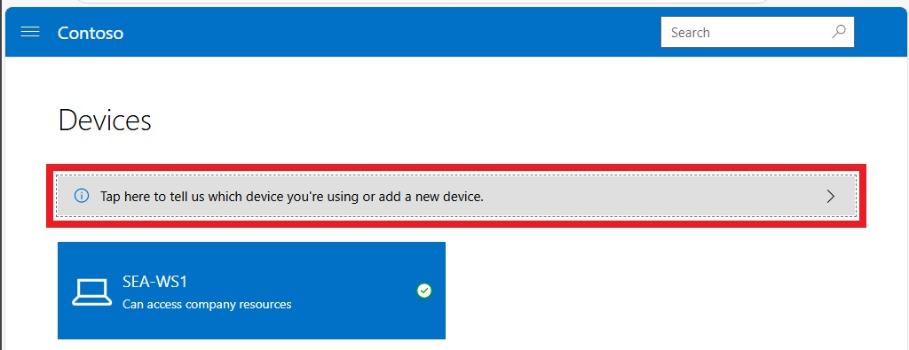
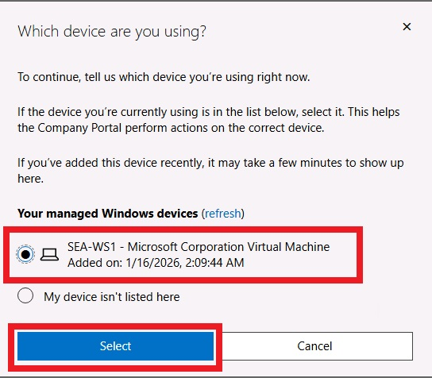
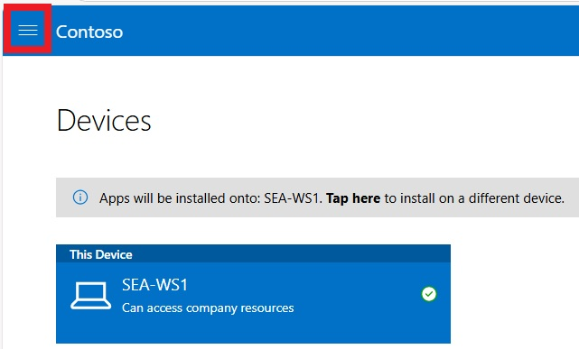

# ラボ 0401: Intune を使用したクラウド アプリのデプロイ

## 概要

このラボでは、Intune とポータル サイト Web サイトを使用して、クラウドベースのアプリを作成して展開します。

### 前提 条件

このラボの前に、次のラボを完了する必要があります。

- 0101 - Entra IDでのアイデンティティの管理

- 0102 - Entra Connect を使用した ID の同期

- 0203-Intuneへのデバイス登録の管理

- 0204-Intune へのデバイスの登録

  > 注: Entra ID への Windows Hello サインイン認証をセキュリティで保護するために使用されるテキスト メッセージを受信できる携帯電話も必要です。

## 演習 1: Microsoft Store アプリを Intune に追加する

### シナリオ

Microsoft Intune を使用して、Contoso Corporation のデスクトップとアプリを管理します。研究部門は、タスクを実行するためにさまざまなサーバーに接続することが多く、必要に応じて研究メンバーがインストールできるように Windows アプリを利用できるように依頼しています。Windows アプリは Microsoft Store から入手できますが、ユーザーがポータル サイト Web サイトからアクセスできるように、アプリを Intune に追加することにしました。Aaron Nicholls という名前の研究メンバーは、アプリをポータルに公開した後、インストール プロセスをテストすることに同意しました。

### タスク 1: Windows アプリを Intune に追加する

1. ブラウザー で、アドレス バーに「**[https://intune.microsoft.com](https://intune.microsoft.com/)**」と入力し、**Enter キー**を押します。

2. テナント管理者パスワードを使用して **`admin@yourtenant.onmicrosoft.com`** としてサインインします。

3. **Microsoft Intune管理センター** ページで、[**アプリ]** を選択し、[**選択]** をクリックします。

4. **[アプリ**] ページのナビゲーション ウィンドウで、 **[すべてのアプリ**] を選択します。

5. 詳細ウィンドウで、 **[+ 作成]** を選択します。

6. [**アプリの種類の選択**] ページで、ドロップダウン メニューをクリックし、[**Microsoft Store アプリ (新規)]** を選択します。**[選択]** をクリックします。

7. [**アプリの追加**] ページで、**Microsoft Store アプリ (新規) を検索する** リンクをクリックします。

8. [**Microsoft Store アプリ (新規) を検索する**] ページで、[**Windows App**] を検索して選択します。**[選択]** をクリックします。

9. **[アプリ情報**] ページで、次の情報を確認し、[**次へ**] を選択します。

   - 名前: **Windows App**
   - 発行元: **Microsoft Corp.**
   - カテゴリー: **ビジネス**
   - おすすめアプリとして表示する: **はい**

10. **[次へ**] を 2 回選択し、[**作成]** を選択します。

11. [Windows アプリ] ページが開きます。

    > [プロパティ]、[デバイスのインストール状態]、および [ユーザーインストールの状態] ノードを確認します。

### タスク2: アプリケーションへのグループの割り当て

1. **[Windows アプリ**] ページの **[管理]** で、[**プロパティ]** を選択します。
2. 詳細ウィンドウで、[**割り当て]** セクションまで下にスクロールし、[**編集]** を選択します。
3. [**割り当て]** ページで、[**登録済みデバイスで使用可能**] で **[グループの追加**] を選択します。
4. **[グループの選択**] ページで、[**Research**] グループを検索して選択し、[**選択]** をクリックします。
5. [**レビューと保存**] を選択し、 **[保存]** を選択します。

### タスク 3: Intune コンソールからポリシー同期を強制する

1. **Microsoft Intune管理センター**で、[**デバイス]** を選択し、[**すべてのデバイス**] を選択します。

2. 詳細ペインで、[**SEA-WS1**] を選択します。

3. [**SEA-WS1**] ブレードで **[同期]** を選択し、プロンプトが表示されたら [**はい**] を選択します。

   > Intune はデバイスに接続し、すべてのポリシーを同期するように指示します。これには最大 5 分かかる場合があります。

### タスク 4: ポータル サイト Web サイトからアプリをインストールする

1. **SEA-WS1** に切り替えます。

2. PIN **102938**を使用して **Aaron Nicholls** としてサインインします。

3. [**Microsoft Edge]** を起動します。

   ※デスクトップのEdgeアイコンを使用することをおすすめします。

   （タスクバーのEdgeアイコンを使用すると、Edgeのプロファイル作成が必要となります。）

4. アドレス バーで **[https://portal.manage.microsoft.com](https://portal.manage.microsoft.com/)** を参照し、**Enter キー**を押します。

5. **Aaron Nicholls** という名前でサインインします。

6. Contoso Web ポータルで、 **[View Devices]** を選択します。

7. [Devices] ページで、上の方に表示される、[**Tap here to tell us which device you're using or add a new device**] をクリックします。

   

8. [**Which device are you using**] ダイアログボックスで、[**SEA-WS1**] の左にあるラジオボタンを選択し、[**Select]** (下にある青いボタン)を選択します。

   

   > [Tap here to tell us which device you're using or add a new device] メッセージだった個所がが [Apps will be installed onto: SEA-WS1] に変わります。

9. 左上隅にあるナビゲーション ボタンを選択します。

   

10. ナビゲーションメニューの  **Apps** を選択します。

> [Apps] ページに一覧表示されている Windows アプリを確認します。アプリが表示されるまでに数分かかる場合があります。

1. [**Windows App**] を選択します。
2. [Windows App] ページで、[**Install]** を選択します。
3. メッセージが表示されたら、[**Install Windows App]** ダイアログ ボックスで、[**Always allow portal.manage.microsoft.com to open links of this type in the associated app**] チェックボックスを **オン** にして、[**Open**] を選択します。

> アプリのインストールには数分かかる場合があります。

1. アプリをインストールしたら、開いているすべてのウィンドウを閉じます。
2. [**Start]** を選択し、[スタート] メニューに **Windows App**が表示されていることを確認します([Recommended]欄を見るか、名前で検索します)。

**結果**: この演習を完了すると、Intune から Microsoft Store アプリが正常に追加され、インストールされます。

## 演習 2: Intune からMicrosoft 365 Appsを構成して展開する

### シナリオ

Contoso の研究部門のすべてのユーザーには、Microsoft 365 Apps が必要です。64 ビット バージョンの Microsoft Excel、Outlook、PowerPoint、Word を Windows デバイスに展開するように求められました。また、更新用の現在のチャネル用に構成されていることを確認する必要があります。

### タスク 1: SEA-WS1 にインストールされているアプリの検証

1. **SEA-WS1** のタスク バーで [**Start**] を選択し、[**Settings**] アプリを選択します。

2. **Settings**アプリで、[**Apps]** を選択し、[**Apps & features**] を選択します。

   > **Microsoft 365 Apps for enterprise - en-us** が一覧に表示されないことを確認します。

3. 開いているすべてのウィンドウを閉じます。

### タスク 2: Microsoft 365 アプリを Intune に追加する

1. Microsoft Intune 管理センターで、[**アプリ]** を選択します。
2. **アプリ |概要**ブレードで、 **[すべてのアプリ]** を選択します。詳細ウィンドウで、**作成** を選択します。
3. [**アプリの種類の選択**] ブレードの **[Microsoft 365 アプリ**] で、 [**Windows 10 以降**] を選択し、[**選択]** をクリックします。
4. [**Microsoft 365 Appsの追加**] ブレードで、次のオプションを構成し、[**次へ**] を選択します。
   - スイート名: **Microsoft 365 Apps (Research)**
   - 説明: **Contoso の研究部門向け Microsoft 365 Apps**
5. [**アプリ スイートの構成]** タブで、[**Office アプリを選択する**] ドロップダウンを展開し、次のアプリのみを選択するようにします。
   - Excel
   - Outlook
   - PowerPoint
   - Word
6. [**アプリ スイートの情報**] セクションで、次のオプションを構成します。
   - アーキテクチャ: **64 ビット**
   - 既定のファイル形式: **Office Open XML 形式**
   - 更新チャネル: **月次エンタープライズ チャネル**
7. [**プロパティ]** セクションで、次のオプションを構成し、[**次へ**] を選択します。
   - ユーザーの代理で Microsoft ソフトウェアライセンス条項に同意する: **はい**
8. [**割り当て]** タブの [**必須]** セクションで、[**グループの追加**] を選択します。
9. [**グループの選択**] ブレードで、 **[Research]** を選択し、 **[選択]** を選択します。
10. [**次へ**] を選択します。[**確認と作成**] タブで、 **[作成]** を選択します。
11. [**Microsoft 365 Apps(Research)]** ページで、[**プロパティ]** を選択します。
12. 詳細ウィンドウで、[**割り当て]** セクションの **[必須]** の下に **[Research**] が表示されていることを確認します。

### タスク 3: Intune コンソールからポリシーの同期を要求する

1. **Microsoft Intune管理センター**で、[**デバイス]** を選択し、[**すべてのデバイス**] を選択します。

2. 詳細ペインで、[**SEA-WS1**] を選択します。

3. [**SEA-WS1**] ブレードで **[同期]** を選択し、プロンプトが表示されたら [**はい**] を選択します。

   > Intune はデバイスに接続し、すべてのポリシーを同期するように指示します。これには最大 15 分かかる場合があります。**SEA-WS1** から同期することを選択できます。

### タスク 4: Microsoft 365 アプリがインストールされていることを確認する

1. **SEA-WS1** に切り替え、Microsoft 365 Suite がデバイスにインストールされるまで約 10 分から 15 分待ちます。

2. **SEA-WS1** からサインアウトし、PIN **102938**を使用して **Aaron Nicholls** として再度サインインします。
3. **SEA-WS1** のタスク バーで [**Start**] を選択し、[**Settings**] アプリを選択します。
4.  **[Settings]** アプリで [**Apps**] を選択し、[**Apps & features**] ページで下にスクロールして、**Microsoft 365 Apps for enterprise - en-us** が一覧表示されていることを確認します。
5. **設定**アプリを閉じて、[**Start]** ボタンを選択します。
6. **Word** を選択し、アプリが開くことを確認します。
7. 開いているすべてのウィンドウを閉じます。
8. SEA-WS1 からサインアウトします。

### タスク 5: Intune でのアプリのインストール状態の監視

1. **SEA-SVR1** に切り替えます。

2. **Microsoft Intune管理センター**で、[**アプリ]** を選択します。

3. **アプリ |概要**ブレードで、 **[監視]** を選択し、 [**アプリのインストール状態**] を選択します。

4. 詳細ウィンドウで、[**Microsoft 365 Apps(Research)]** を選択します。

5. 詳細ウィンドウの **[監視]** と **[ユーザーのインストール状態**] で、[インストール済み] に **1** が表示されていることを確認します。

   *注: 情報が表示されるまでに時間がかかる場合があります。*

   *注: これは、アプリが 1 つのデバイスに 1 人のユーザーに対してインストールされていることを示します。*

6. [**デバイスのインストール状態**] を選択します。

   > 詳細ウィンドウには、アプリがインストールされているデバイスと、ユーザーの名前が表示されます。[**デバイス名(Device Name**)] 列には **SEA-WS1** がリストされ、[**ステータス(Status)]** 列には [**インストール済み(Installed)]** と表示されます。これは、アプリが SEA-WS1 にインストールされていることを意味します。

7. **Microsoft Intune管理センター**で、[**デバイス]** を選択します。

8. **デバイス上 |概要**ブレードで [**すべてのデバイス**] を選択し、詳細ウィンドウで [**SEA-WS1]** を選択します。

9. [**SEA-WS1**] ブレードで、[**マネージド アプリ]** を選択します。

10. **SEA-WS1 |[マネージド アプリ]** ブレードの詳細ウィンドウで、[**Microsoft 365 Apps(Research)]** を選択します。

> [**Microsoft 365 Apps(リサーチ) - インストールの詳細]** ウィンドウでは、アプリケーションのライフサイクル全体、つまり、アプリケーションの作成、割り当て、インストール時刻と状態、およびデバイスが最後にチェックインした時刻 (Intune と同期) を確認できます。

1. 開いているすべてのウィンドウを閉じます。

**結果**: この演習を完了すると、Intune からMicrosoft 365 Appsを正常に構成して展開できます。

**ラボの終わり**
