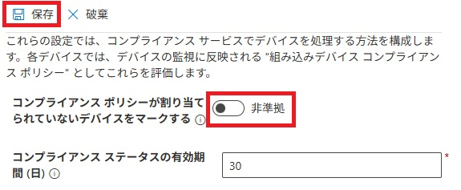
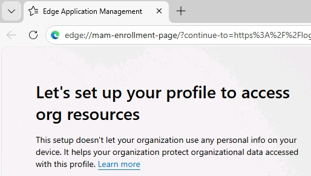

# ラボ 0503: デバイス コンプライアンスの構成と検証

## 概要

このラボでは、マネージド デバイスの状態を判断するために使用されるコンプライアンス ポリシーと関連する条件付きアクセス規則を構成して、デバイスのコンプライアンスを検証します。

### 前提 条件

このラボの前に、次のラボを完了する必要があります。

- 0101 - Entra IDでのアイデンティティの管理

- 0102 - Entra Connect を使用した ID の同期

- 0203-Intuneへのデバイス登録の管理

- 0204-Intune へのデバイスの登録

- 0301-構成プロファイルの作成と配備

  > 注: Entra ID への Windows Hello サインイン認証をセキュリティで保護するために使用されるテキスト メッセージを受信できる携帯電話も必要です。

## 演習 1: コンプライアンス・ポリシーの構成

### シナリオ

Contoso は、Intune に登録されている Windows デバイスが最小構成仕様を満たしていることを確認したいと考えています。必要な仕様は次のとおりです。

- Windows オペレーティング システムの最小バージョン: 10.0.19041.329
- Microsoft Defender マルウェア対策が必要

デバイスがこれらの要件を満たしている場合、準拠としてマークされます。デバイスがこれらの要件を満たしていない場合は、デバイスを非準拠としてマークする必要があります。

### タスク1: コンプライアンス・ポリシーの作成および割当て

1. ブラウザーで、アドレス バーに「**[https://intune.microsoft.com](https://intune.microsoft.com/)**」と入力し、**Enter キー**を押します。

2. 既定のテナント パスワードを使用して、**`admin@yourtenant.onmicrosoft.com`** としてサインインします。

3. ナビゲーション ウィンドウから **[デバイス]** を選択し、 **[コンプライアンス]** を選択します。

4. **デバイス |[コンプライアンス]** ブレードの詳細ウィンドウで、 **[+ ポリシーの作成**] を選択します。

5. [**ポリシーの作成**] ブレードで、次の値を指定し、 **[作成]** を選択します。

   - プラットフォーム: **Windows 10 以降**
   - プロファイルの種類: **Windows 10/11 コンプライアンス ポリシー**

6. [**基本]** タブで、次の値を指定し、[**次へ**] を選択します。

   - 名前: **コンプライアンス1**

7. [**コンプライアンス設定]** タブで、[**デバイスの正常性**] を展開し、使用可能な設定を確認します。

8. [**コンプライアンス設定]** タブで、[**デバイスのプロパティ]** を展開します。[**最小 OS バージョン]** フィールドに「**10.0.19041.329**」と入力します。

9. [**コンプライアンス設定]** タブで、[**システム セキュリティ]** を展開します。**[Microsoft Defender マルウェア対策**] 設定を **[必要]** に設定します。

10. [**次へ**] を選択します。[ **非準拠のアクション** ] タブで、[ **デバイス非準拠の既定値にマークする ]** のアクションが **[即時**] であることに注意してください。

    > デバイスが非準拠としてマークされるまでの日数を設定する方法と、追加のアクションを設定する方法を確認します。

11. [**次へ**] を選択します。[**割り当て]** タブの **[組み込まれたグループ]** で **[グループを追加**] を選択します。**[Windows Device]** を選択し、[**選択]** を選択して、[**次へ**] を選択します。

    *注: **Windows Device** グループは、ラボ 0301: 構成プロファイルの作成と展開で作成されました。*

12. [**確認および作成**] タブで、設定を確認し、[**作成]** を選択します。

13. ナビゲーション メニューで **[デバイス]** を選択し、[デバイス] ナビゲーション ウィンドウで、[デバイスの管理]セクションにある **[コンプライアンス]** を選択します。

14. **デバイス |[コンプライアンス]** ブレードで、上の方にある[**コンプライアンス設定]** タブを選択します。

15. [**コンプライアンス設定]** ページで、[**コンプライアンス状態の有効期間**] に **30** が表示されていることを確認します。指定されていない場合は、その値を入力します。

16. [**コンプライアンス設定]** ページで、 **[コンプライアンス ポリシーが割り当てられていないデバイスをマークする]** のスライドバーをクリックして、表示を[準拠]から[**非準拠**] に切り替えて、[**保存]** を選択します。

    

    > この設定により、コンプライアンス ポリシーが割り当てられていないデバイスはすべて [**非準拠]** に設定されます。

**結果**: この演習を完了すると、コンプライアンス ポリシーが正常に構成されます。

## 演習 2: コンプライアンスを適用するための条件付きアクセス ポリシーを作成する

### シナリオ

ユーザーが非準拠としてマークされたデバイスを使用すると、電子メールにアクセスできなくなります。このルールを適用する条件付きアクセス ポリシーを構成し、期待どおりに機能することを確認するように求められました。場合によっては、サインインを繰り返し求められるループが発生することがあります。

### タスク 1: 条件付きアクセス ポリシーを作成する

1. **SEA-SVR1** では、**Intune 管理センター**で **[デバイス]** を選択し、 **[条件付きアクセス]** を選択します。
2. **条件付きアクセス |[概要]** ブレードで、 **[ポリシー]** を選択します。
3. **条件付きアクセス |[ポリシー]** ブレードで、 [**新しいポリシー**] を選択します。
4. [**新規]** ブレードの [**名前**] テキスト ボックスに **Conditional1** と入力し、 **ユーザーまたはエージェント (プレビュー) が選択されていません** のリンクを選択します。
5. **[対象]** で、[**ユーザーとグループの選択**] ラジオ ボタンを選択します。
6. [**ユーザーとグループ**] の横にあるチェック ボックスをオンにします。
7. [**ユーザーとグループの選択**] ページで、 **[Aaron Nicholls**] (「検索」で探すことができます)の横にあるチェック ボックスをオンして、[**選択]** を選択します。
8. [**ターゲット リソース]** セクションで、[**ターゲット リソースが選択されていません**] を選択します。
9. **[対象]** タブで [**リソースの選択**] ラジオ ボタンを選択し、[特定のリソースを選択する]セクション で [**なし**] を選択し、[**Office 365 Exchange Online**] を選択して、[**選択]** をクリックします。
10. [**条件]** セクションで、**0 個の条件が選択されました** を選択します。
11. 条件のリストで、[**デバイス プラットフォーム**] で [**未構成]** を選択します。[**構成]** セクションで [**はい**] を選択し、[**デバイス プラットフォームの選択**] ラジオ ボタンを選択し、[**Windows**] チェック ボックスをオンにして、[**完了]** を選択します。
12. [**許可]** セクションで、**0 個のコントロールが選択されました**を選択します。[**デバイスは準拠しているとしてマーク済みである必要があります]** チェック ボックスをオンにし、[**選択]** を選択します。
13. [**新規]** ブレードの [**ポリシーをの有効化]** オプションで **[オン**] を選択し、 **[作成]** を選択します。
14. Microsoft Edge を閉じます。

### タスク 2: 条件付きアクセス ポリシーが機能していることを確認する

1. **SEA-WS3** に切り替え、**Pa55w.rd** のパスワードで**Admin**としてサインインします。

2. **SEA-WS3** のタスク バーで、[**Microsoft Edge]** を選択します。

3. Microsoft Edge で、「**outlook.office.com**」と入力し、Enter キーを押します。

4. [Pick an account]] ダイアログ ボックスで、**`Aaron@yourtenant.onmicrosoft.com`** を選択します。

5. [**パスワードの入力**] ページで、「 **Pa55w.rd1234!** 」 と入力し、[**Sing in]** を選択します。

   > **手記**Microsoft Edge の [パスワードの保存] プロンプトが表示されたら、[**Update]** を選択します。

6. Edge プロファイルを切り替えるように求めるメッセージが表示されます。**[Switch Edge profile]** を選択します。

7. 「**Continue with your work or school account**」というメッセージが表示されます。**[Sign in to sync data]**　を選択してデータを同期します。

8. パスワードの入力を再度必要とします。**Pa55w.rd1234!** と入力し、[**Sign in]** を選択します。

9. 「**Automatically sign in to all desktops apps and websites on this device?**」というダイアログ ボックスが表示されます。[**No, sign in to this app only]** を選択します。

   

   > 注: 「**Let's set up your profile to access org resources**」というダイアログが表示されます。これは、SEA-WS3 が Entra ID に参加しておらず、Intune によって管理されていないためです。(下記スクリーンショットの左下に[Continue]ボタンがありますが、選択してもサインインの最初からやり直しとなります。)
   >
   > そのため、このデバイスからAaronのメールボックスにアクセスすることはできません。

   

10. すべてのウィンドウを閉じて、**SEA-WS3** からサインアウトします。

11. **SEA-WS1** に切り替え、PIN **102938**を使用して Aaron Nicholls としてサインインします。

    > 注: SEA-WS1 は、Intune に登録されているマネージド Windows 11 デバイスです。

12. タスク バーで、[**Microsoft Edge]** を選択します。

13. Microsoft Edge で、「**outlook.office.com**」と入力し、Enter キーを押します。必要に応じて、「**Pa55w.rd1234!」** のパスワードでサインインします。[**Stay signed in?]** プロンプトでは [**No**] を選択します。

14. Aaron のメールボックスにアクセスできることを確認します。

    > 注:これは、SEA-WS1が管理対象デバイスであり、準拠としてマークされているためです。

15. Microsoft Edge を閉じて、SEA-WS1 からサインアウトします。

### タスク 3: 条件付きアクセス ポリシーを無効にする

1. Microsoft Intune 管理センターの画面に切り替えます。

5. ナビゲーション ウィンドウから **[デバイス]** を選択し、[**すべてのデバイス**] を選択します。

   > SEA-WS1 は準拠しているため、Aaron は自分のメールボックスへのアクセスを許可されました。

6. ナビゲーション ウィンドウから **[デバイス]** を選択し、 **[条件付きアクセス]** を選択します。

7. [**条件付きアクセス]** ページで、[**ポリシー]** を選択し、 **[Conditional1]** を選択します。

8. [**Conditional1]** ページの下部にある **[オフ]** を選択し、 [**保存**] を選択します。

9. Microsoft Edge を閉じます。

**結果**: この演習を完了すると、デバイスのコンプライアンスを判断するための条件付きアクセス ポリシーが正常に構成されます。

**ラボの終わり**
