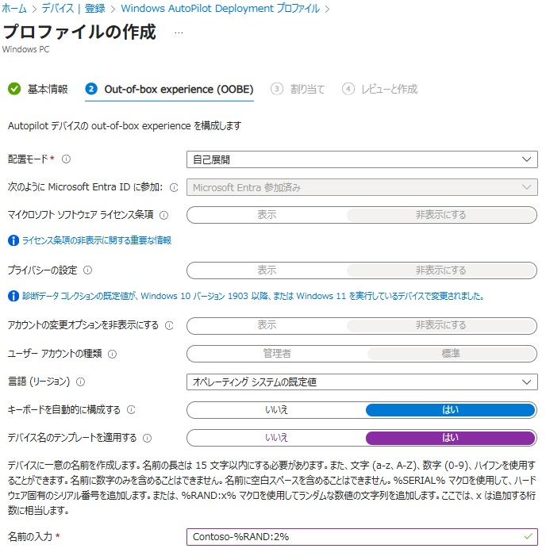
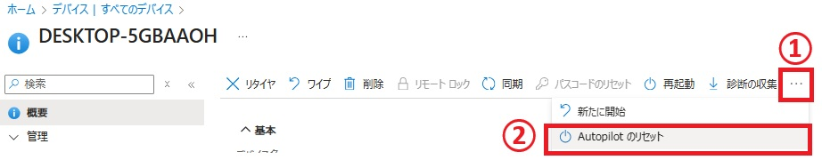

# 【参考手順】ラボ: Autopilot リセットと自己展開モードで Windows を更新する

## 概要

このラボでは、リモート オートパイロット リセットを実行する方法を学習します。

### 前提 条件

このラボの前に、次のラボを完了する必要があります。

- 0101-Azure AD での ID の管理
- 0102 - Entra Connect を使用した ID の同期
- 0701 - Microsoft Deployment Toolkitを使用したWindows 11の展開
- 0801- Autopilotを使用したWindows 11の展開

### シナリオ

SEA-WS4 は、Windows Autopilot を使用して展開されています。Autopilot リセットを含む別のプロビジョニング シナリオをテストする必要があります。Windows Autopilot 自己展開モードで構成された新しい展開プロファイルを作成します。

### タスク 1: 自己展開 Windows Autopilot 展開プロファイルの構成

1. ブラウザーで **[https://intune.microsoft.com](https://intune.microsoft.com/)** に移動します。メッセージが表示されたら、**`Admin@yourtenant.onmicrosoft.com`** でサインインします。

2. **Microsoft Intune管理センター**で、[**デバイス]** を選択します。

3. [ **デバイスのオンボードディング** ] セクションで、[**登録]** を選択します。

4. [Windows 登録] タブで、詳細ウィンドウの **[Windows Autopilot**] まで下にスクロールし、[**デバイスプロファイル]** を選択します。

5. **[Windows AutoPilot 展開プロファイル]** ブレードで、 [**Contoso profile1]** を選択し、 **[プロパティ]** を選択します。

6. [**割り当て]** まで下にスクロールし、[**編集]** を選択します。

7. **[IT Devices]** の横にある [**削除**] を選択します。

8. [ **レビューと保存** ] を選択し、[**保存]** を選択します。

9. **Contoso profile1 | プロパティ** ページ **[x]** をクリックして閉じます。

10. [**Windows AutoPilot Deployment プロファイル]** ブレードで、 [**プロファイルの作成**] を選択し、 [**Windows PC**] を選択します。

11. [**基本]** タブの [**名前**] テキスト ボックスに「**Contoso profile2**」と入力します。

12. **[すべての対象 デバイスを Autopilot に変換する]** で [**いいえ**] を選択し、 [**次へ**] を選択します。

13. [ **Out-of-box experience (OOBE)]** タブで、[ **配置モード** ] を **[自己展開]** に設定します。

14. 次のオプションが設定されていることを確認します。

    - 言語 (リージョン): **オペレーティング システムの既定値**

    - キーボードを自動的に構成する: **はい**

    - デバイス名のテンプレートを適用する: **はい**

    - 名前の入力: **Contoso-%RAND:2%**

      

15. [**次へ**] を選択します。

16. [**割り当て]** タブの **[包含されたグループ]** で **[グループの追加**] を選択します。

17. **[IT Devices]** グループを選択し、[**選択]** をクリックします。[**次へ**] を選択します。

18. [**確認および作成**] ブレードで、情報を確認し、 **[作成]** を選択します。

### タスク 2: オートパイロット リセットを実行する

1. **Microsoft Intune管理センター**で、[**デバイス]** を選択し、[**すべてのデバイス**] を選択します。

2. Autopilot PC (DESKTOP という名前で始まる) を選択します。

3. メニュー バーで省略記号を選択し、**Autopilot のリセット** を選択します。

   

4. メッセージ プロンプトで、[**はい**] を選択します。

5. **SEA-WS3** に切り替えます。

   > 注: SEA-WS3 は、前のラボから実行されている必要があります。

6. **SEA-WS3** を再起動します。

   > 注: このプロセスには 30 分から 45 分かかる場合があり、プロセス中に数回再起動します。

### タスク3: Autopilotデプロイメントの検証

1. [**Let's set things up for your work or school**] ページで、「**`Aaron@yourtenant.onmicrosoft.com`**」と入力し、[**次へ**] を選択します。

2. [パスワード] ページで、「 **Pa55w.rd1234!** 」と入力し、[**Sign in]** を選択します。

3. [**Use Windows Hello with your account**] で、[**OK]** を選択します。

4. [Verify your identity] ページで、[ **Text +XX XXXXXXXX** ] を選択します。

5. **[Enter code**] ページで、モバイル デバイスにテキストで送信されたコードを入力し、[**確認]** を選択します。

6. **Setup up a PIN** ダイアログ ボックスの **New PIN** フィールドと **Confirm PIN** フィールドに「**102938**」と入力し、**OK** を選択します。

7. **[All set!]** ページで、[**OK]** を選択します。

8. [**Start]** を選択し、[**Settings]** を選択します。

9. **[Accounts]** を選択し、 [**Access work or school**] を選択します。デバイスが Contoso の Azure AD に接続されていることを確認します。

10. **[Connected to Contoso's Azure AD]** を選択し、 [**Info**] を選択します。

11. [**Managed by Contoso]** ページで、下にスクロールして **[Sync]** を選択します。

12. **SEA-WS3** では、[**Settings**] ウィンドウを閉じます。

    **結果**: この演習を完了すると、自己展開モードを使用して Autopilot リセットを使用して Windows デバイスをプロビジョニングします。

**ラボの終わり**
